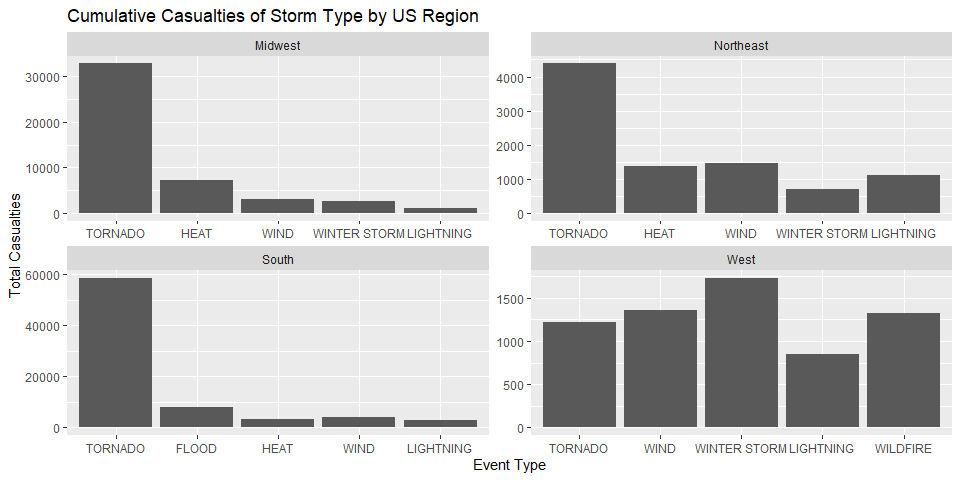
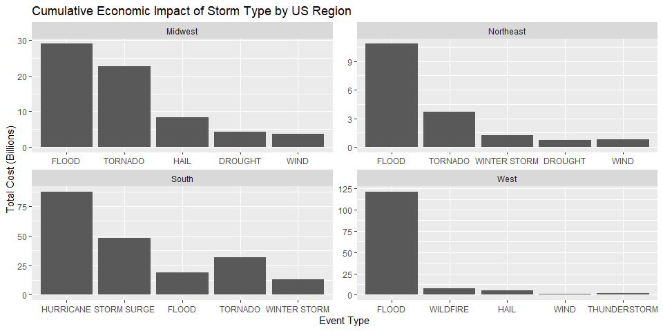

Synopsis
--------

The purpose of this study is to analyze NOAA storm data and determine
which types of storm event are most damaging both in terms of human
casualties and damage to property and crops. In order to examine the way
the answer to this question may differ across different parts of the
country, states were divided into 4 regions: Northeast, South, Midwest
and West.

For each region, the 5 most damaging storm types were found in terms of
both casualties and economic cost. These top 5 storm types were then
plotted as bar charts and compared across region. In terms of
casualties, tornadoes were found to be the most dangerous storm event in
each region except the West. The most dangerous storm event in the West
was winter storms. In terms of economic cost, the most expensive storm
events were floods in the Northeast, Midwest and West, and hurricanes in
the South.

Data Processing
---------------

The first step is to download the NOAA data.

    temp <- tempfile()
    download.file("https://d396qusza40orc.cloudfront.net/repdata%2Fdata%2FStormData.csv.bz2",temp)
    df <- read.csv(bzfile(temp))
    unlink(temp)

Because this dataset is assembled by many different people around the
country, there are formatting issues that make it difficult to work with
in its raw form. First of all, there is the column EVTYPE, which
contains the event type data which we are interested in analyzing.
Unfortunately, the column contains multiple different descriptions for
the same type of event. In order to clean up the data, we need to make
use of the grepl() function in R to find rows containing certain string
patterns. Code with the following pattern was used to tidy up the column
and group most different event types:

    df[grepl('HURRICANE',df$EVTYPE, ignore.case = TRUE), 'EVTYPE'] <- 'HURRICANE'

Next, we defined our regions using the STATE column. We created a new
column region to contain the data. The regions were defined and added to
the dataframe using the following pattern:

    northeast = c('ME', 'NH', 'VT', 'MA', 'CT', 'RI', 'NY', 'NJ', 'PA')
    df$region <- 'Other'
    df[as.character(df$STATE) %in% northeast, 'region'] <- 'Northeast'

Note that the region column is initialized with value ‘Other’ so that
territories outside the 50 states will fall into that category if they
do not appear in our lists.

Next, we need to process the property damage and crop damage columns.
These columns are rounded to 3 significant digits with the adjacent EXP
columns used to express the magnitude in factors of ten. However, like
with the EVTYPE column, the formatting is not consistent. For example,
hundreds could be expressed as ‘h’, ‘H’, or 2, with the latter
representing 10^2. In order to address this, we first convert this
column to a numeric representing the multiplicative factor

    df$propDmgCoeff <- 1
    df$cropDmgCoeff <- 1
    df[df$PROPDMGEXP %in% c('h', 'H', 2), 'propDmgCoeff'] <- 100
    df[df$CROPDMGEXP %in% c('h', 'H', 2), 'cropDmgCoeff'] <- 100

…then multiply the factor by the corresponding PROPDMG/CROPDMG columns:

    df$propDmgCost <- df$PROPDMG * df$propDmgCoeff
    df$cropDmgCost <- df$CROPDMG * df$cropDmgCoeff

Next we create our casualties and cost columns. Casualties is the sum of
fatalities and injuries. Cost is the sum of property damage and crop
damage.

    df$casualties <- df$FATALITIES + df$INJURIES
    df$cost <- df$propDmgCost + df$cropDmgCost

Next we use dplyr to group by event type and region and summarize each
combination.

    eventTypes <- df %>% 
        group_by(EVTYPE, region) %>% 
        summarize(count = n(),
                  sumCasualties = sum(casualties),
                  avgCasualties = mean(casualties),
                  maxCasualties = max(casualties),
                  medianCasualties = median(casualties),
                  sumFatalities = sum(FATALITIES),
                  avgFatalities = mean(FATALITIES),
                  maxFatalities = max(FATALITIES),
                  medianFatalities = median(FATALITIES),
                  sumCost = sum(cost),
                  avgCost = mean(cost),
                  maxCost = max(cost),
                  medianCost = median(cost))
    eventTypes <- data.frame(eventTypes)

We use the slice\_max function to select the 5 event types with the
highest casualties and highest cost got each region with the following
pattern:

    topCasualtiesNortheast <- eventTypes[eventTypes$region == 'Northeast', ] %>% 
        filter(!is.na(sumCasualties)) %>%
        slice_max(order_by = sumCasualties, n = 5, with_ties = FALSE)

    topCostNortheast <- eventTypes[eventTypes$region == 'Northeast', ] %>% 
        filter(!is.na(sumCost)) %>%
        slice_max(order_by = sumCost, n = 5, with_ties = FALSE)

And finally we combine these regional dataframes back together to
prepare to plot.

    topCost = rbind(topCostNortheast, topCostSouth, topCostMidwest, topCostWest)
    topCasualties = rbind(topCasualtiesNortheast, topCasualtiesSouth, topCasualtiesMidwest, topCasualtiesWest)

Results
-------

    ggplot(topCasualties, aes(x=reorder(EVTYPE, -sumCasualties), y=sumCasualties)) +
        geom_bar(stat="identity") +
        facet_wrap(region ~ ., scales="free") +
        xlab("Event Type") +
        ylab("Total Casualties") +
        ggtitle('Cumulative Casualties of Storm Type by US Region')

    ggplot(topCost, aes(x=reorder(EVTYPE, -sumCost), y=sumCost/1000000000)) +
        geom_bar(stat="identity") +
        facet_wrap(region ~ ., scales="free") +
        xlab('Event Type') +
        ylab('Total Cost (Billions)') +
        ggtitle('Cumulative Economic Impact of Storm Type by US Region')

